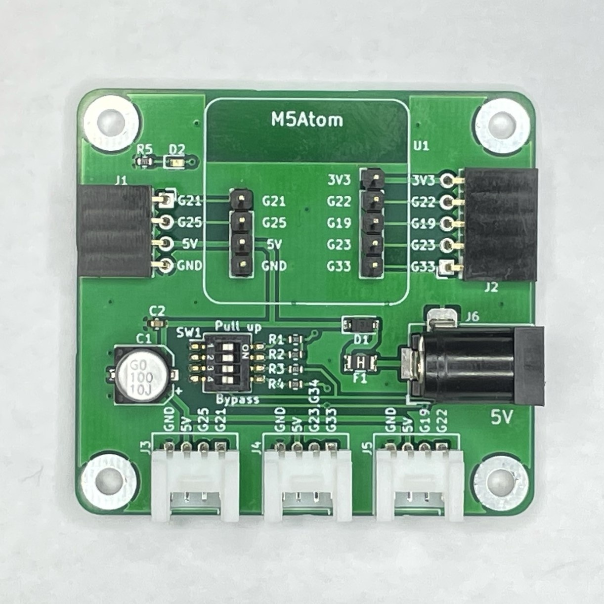
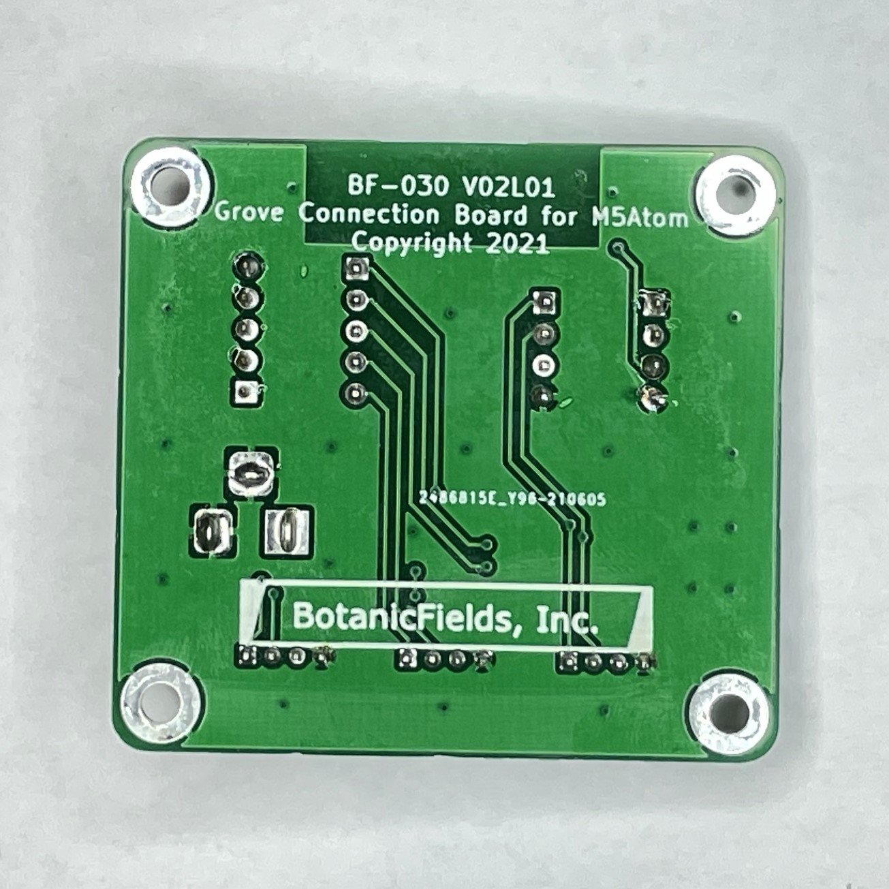
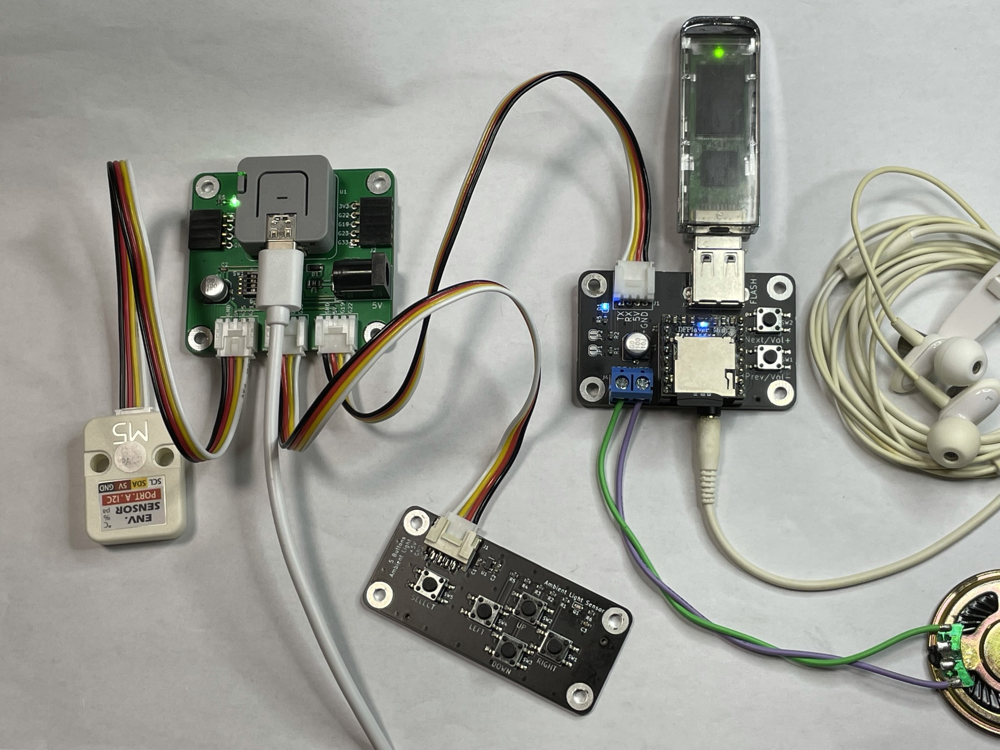
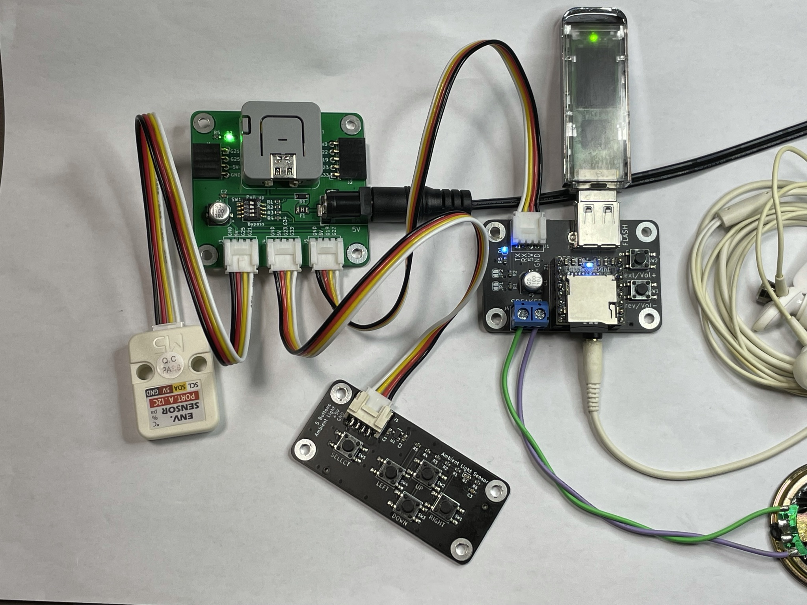

# PCB-Grove-for-M5Atom
a PCB to add 3 Grove Connectors to M5Atom

# M5Atom 用 GROVE コネクタ基板

M5Atom のピンソケット (GPIO) を GROVE コネクタに変換する基板です。
GROVE ケーブルによるデバイスの接続が簡単になります。

 

## 1. 特徴

- 基板上のピンヘッダに M5Atom Lite/Matrix を直接接続できます。
- M5Atom の GPIO を GROVE コネクタ 3 個で取り出せます。M5Atom の Grove ポートと合わせて計 4 ポートとなります。
- M5Atom のピンソケットを、基板上のピンソケットから取り出せます。
- DC ジャック (5V) があり、USB-C ケーブルと同時または単独でも給電できます。DCジャックからの電源にはフューズがあります。
- ディップスイッチで、一部プルアップ抵抗/保護抵抗の接続/バイパスができます。

※ 動作中の電源の抜き差し (USB-C / DC ジャック) は、動作継続を保証できません。

## 2. ご注意

- M5Atom は付属しません。
- AC アダプタは付属しません。
- GROVE ケーブルは付属しません。
- ディップスイッチの切り替えには、ピンセット等が必要です。
- プリント基板単体の完成品です。ケースや足は付属しません。裏面からピンが飛び出しています。絶縁材や四隅の穴にスペーサを取り付けるなどして、負傷、静電気破壊、机などの傷を防止してください。

## 使用例
「ENV ユニット」(I2C)、「M5 用光センサ・押しボタン 5 基板」(アナログ)、「DFPlayer-Mini用 Grove 接続基板」(UART) を同時接続し、USB-C または DC 5V 電源を接続しています。動作に使用したプログラム BF-030.ino は、温度・湿度・気圧・周囲の明るさをシリアルモニタに定期的に表示する一方、押しボタンで楽曲の演奏を制御（次の曲、前の曲、音量増、音量減、USB/microSD 切替）できます。

 

## 3. 詳細

回路図をご確認ください。

| GROVE | pin 1 | pin 2 | pin 3 | pin 4 | 想定用途 | 備考 |
|:-:|:-|:-|:-:|:-:|:-:|:-:|
|  J3  | G21 (SCL) | G25 (SDA) | +5V | GND  | I2C | プルアップ抵抗(*1)設定可 |
|  J4  | G33 | G23, G34 | +5V | GND  | アナログ入力 | - |
|  J5  | G22 (RX) | G19 (TX) | +5V | GND  | シリアル |  保護抵抗(*2)バイパス可 |

(*1) DIP スイッチ 1, 2 を ON にすると、プルアップ抵抗 (10kΩ) が有効となります。I2C では M5Atom 内蔵のプルアップ機能があり、またデバイス側にもプルアップ抵抗があったりするため通常は不要ですが、外付けが必要な場合に使えます。
 
(*2) DIP スイッチ 3, 4 を ON にすると、保護抵抗 (1kΩ) をバイパスします。保護抵抗は、5V 系のシリアルインタフェースを 3.3V 系である M5Atom の RX に接続する場合の過電圧から保護します。3.3V 系との接続では保護抵抗をバイパスできます。3.3V で出力する TX には保護抵抗は不要と考えられますが、実験での接続ミスなどを考慮して使用することもできます。

| DIP スイッチ 番号 | 影響するピン | ON の場合 |
|:-:|:-:|:-:|
| 1 | G21 (SCL) | プルアップ抵抗 (10kΩ) を接続 |
| 2 | G25 (SDA) | プルアップ抵抗 (10kΩ) を接続 |
| 3 | G22 (RX)  | 保護抵抗(1kΩ) をバイパス |
| 4 | G19 (TX)  | 保護抵抗(1kΩ) をバイパス |

DC ジャックからの電源にはフューズ (PTC リセッタブル、保持電流 1.1A, トリップ電流 2.2A) があります。ちなみに M5Atom 内部には 5V 出力に 0.5A のフューズがあります。
